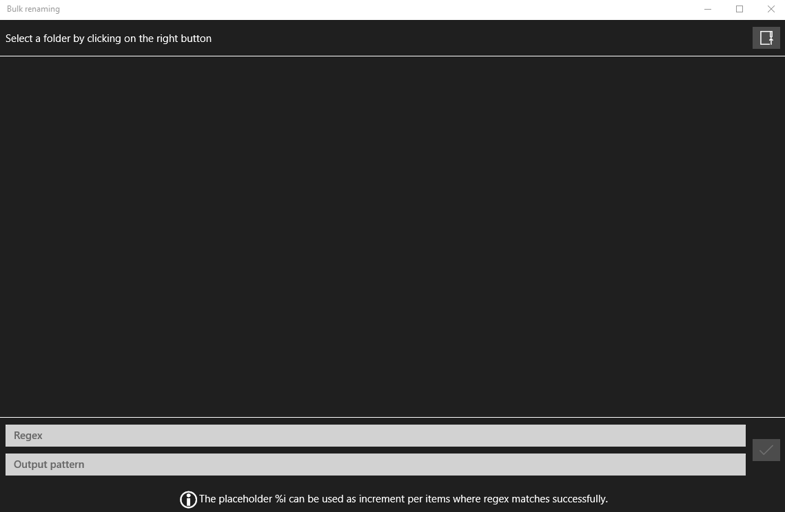
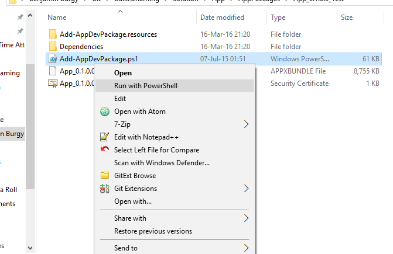
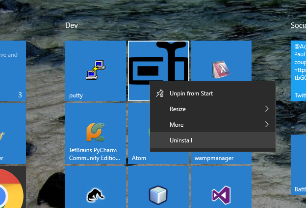

# Why?

I wanted test to develop an *Universal App* and I needed a tool for renaming lots of files easily.

# Goal

Provides a basic utility application for renaming many files with a live preview using a regular expression for capturing some parts of the original file name and formatting a new file name.

## How to install the application without the Windows store

To be able to install the application without the Windows store you have to trust my self-signed certificate and run the powershell script generated by Visual Studio, it will install the application on your computer and.

Download the latest [release](https://github.com/minidfx/BulkRenaming/releases) from GitHub and run the script powershell.

**WARNING:** During the installation you have to trust my self-signed certiticate to install the application.

## How to uninstall

You can uninstall the application by just clicking with the right button on the **Bulk Renaming** application and select **uninstall**.

